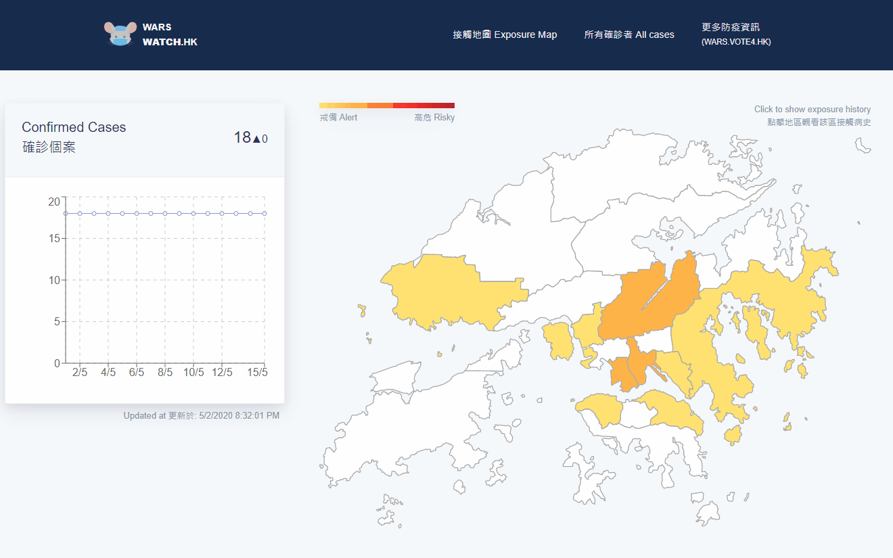

### Misc.
- This is a project archive.
- Project stack: **Gatsby/react.js, GraphQL, Firebase**
- Project dated **April 2020**

# [WARS Watch HK]
- Built with Gatsby for the front-end, using Firebase on GraphQL for the backend
- The website tracks new confirmed cases of COVID-19 and present in a map-style
- A script was created to automatically add information entered (by volunteers / maintainers) on a GSpreadsheet to the Firebase backend periodically.

